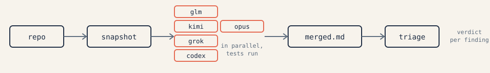

<p align="center">
  
</p>

# external-review

**A second opinion on your code from other model families.** Reviewers (GLM, Kimi, Grok, Codex,
Claude Opus) run as autonomous agents inside a disposable snapshot of your repository: they read the
code, run your tests, write throwaway scripts to reproduce hypotheses, and return a report where every
finding carries evidence. You write a brief, launch everyone in parallel, merge the reports and triage
them against the real code.

<p>
  <a href="LICENSE"></a>
  
  
  
  <a href="https://github.com/genhoi/external-review/actions/workflows/ci.yml"></a>
  <a href="README.ru.md"></a>
</p>

## Why

- **Different priors.** A model reviewing code written by its own family rationalizes the same way the
  author did. GLM, Kimi, Grok and Codex miss different things; findings they agree on are almost
  certainly real, findings they disagree on are exactly where you should look yourself.
- **Reviewers execute, not skim.** Each one works in a writable git worktree snapshot with your
  dependencies symlinked in: it runs the test suite, writes a repro, applies a candidate fix and
  reverts it. A finding without a trigger and evidence does not make it into the report.
- **Harness-agnostic.** The orchestrator can be Claude Code, or GLM/Kimi running inside Claude Code
  when your Claude quota is gone, or Codex — anything with a shell. The scripts need only `bash`,
  `git` and `python3`.

## Quick start

```bash
git clone https://github.com/genhoi/external-review ~/.claude/skills/external-review
R=~/.claude/skills/external-review/bin/review

$R doctor                        # which reviewers are available (keys/logins: references/setup.md)
$R brief --out /tmp/brief.md     # fill it in: intent, cost of failure, how to run the tests
$R preflight '.venv/bin/pytest'  # prove that command works inside a snapshot, not just in your checkout
$R run --brief /tmp/brief.md     # snapshot + every available reviewer, in the background
$R wait                          # ...or keep working and check `$R status` now and then
$R collect                       # merged.md: findings table × reviewer + full reports
```

Then triage per [`references/triage.md`](references/triage.md): a verdict for every finding, verified
against the code. Inside Claude Code the skill triggers on "get a second opinion from other models",
"external review", "run it through GLM/Grok/Codex".

## How it works

<picture>
  <source media="(prefers-color-scheme: dark)" srcset="docs/assets/flow-dark.svg">
  
</picture>

1. **Snapshot.** `review run` commits your working tree (uncommitted and untracked files included) to a
   temporary commit and checks it out as a detached worktree per reviewer. `vendor`, `node_modules`,
   `.venv`, `.env*` are copied in (`--deps hardlink|symlink|none` to change), so tests run inside the
   snapshot even when they go through a docker bind mount. The reviewer can run and modify anything
   there; your tree is never touched. Guardrails where the CLI supports them: deny rules for the Claude family, kernel
   sandbox for Grok and Codex.
2. **One protocol for everyone** ([`prompts/en/reviewer.md`](prompts/en/reviewer.md)): orientation →
   hypotheses specific to this change → verification by execution → report. Every finding is tagged
   `ran | read | inferred` with a confidence score; the report ends with a "Checked, fine" section, a
   "Could not verify" section, a verification log and a machine-readable block.
3. **The brief is the main input** ([`prompts/en/brief.md`](prompts/en/brief.md)): intent, cost of
   failure, exact test commands and what is unavailable, non-obvious stack properties, known decisions.
   The stable part lives in your repository: a `## External review` section in `AGENTS.md` or
   `CLAUDE.md` is appended to every brief automatically. `--blind` hides the intent from the reviewer
   to catch what the brief unintentionally justifies.
4. **Merge.** `review collect` groups findings by file and line; those flagged by several reviewers
   come first. `review ask RUN glm "..."` resumes a reviewer's session with counter-evidence.
5. **Triage** stays with you: accept or reject each finding after checking the code, fix, rerun the
   full suite.

## Reviewers

| Reviewer | Runs as | Needs |
|---|---|---|
| `glm` | Claude Code → z.ai, `glm-5.3[1m]`, effort max | GLM Coding Plan key |
| `kimi` | Claude Code → api.kimi.com, `k3[1m]`, effort max | Kimi Code subscription key |
| `opus` | Claude Code, `opus`, effort max | Claude subscription |
| `grok` | grok CLI, `grok-4.6`, effort xhigh, kernel sandbox | xAI subscription |
| `codex` | codex CLI, `codex exec`, `gpt-5.6-sol`, effort ultra, sandbox workspace-write | ChatGPT subscription |
| `kimi-cli` | kimi-code CLI (OAuth) | fallback path |

Models are not hard-coded into the scripts: `review config set CODEX_MODEL gpt-5.7-sol` writes
`~/.config/external-review/config.env`, which survives updates of the skill.

## What a report looks like

An excerpt from GLM-5.3's report on the test fixture (`tests/make-fixture.sh`, English protocol, 4m35s, 25 tool calls). Every finding was reproduced by running code in the snapshot:

```markdown
## Summary
Intent as understood: (1) deduplicate PayGate webhook redeliveries, (2) add an `is_active` subscription check, (3) validate discount percent in `apply_discount` — while first-delivery charging behavior stays unchanged. Verdict: **not ready**. The headline feature does not work against the provider's own documented redelivery semantics (docs/provider.md: the event `id` is regenerated on redelivery; only `payment_id` stays stable), so a redelivery is credited twice. Top 3 must-fix:

1. webhooks.py dedupes on the field the provider regenerates → double credit (critical).
2. `is_active` compares naive-UTC `expires_at` to naive *local* `now` → subscriptions expire 5 h early on Asia/Almaty servers.
3. The new webhook test asserts `processed_count >= 1`, green on the double-credit path — false coverage.

## Findings

### 1. [critical] [confidence 99] billing/webhooks.py:13 — dedupe key uses `event["id"]`, which the provider regenerates on every redelivery
- What breaks: docs/provider.md:4-5 states delivery is at-least-once and *"При повторной доставке провайдер генерирует НОВЫЙ `id` события, стабильным остаётся только `payment_id` (и `type`)"*. The new key `f"{event['type']}:{event['id']}"` therefore never matches on a real redelivery — the event is applied again and the payment credited twice.
- Evidence (ran): two events with different `id`, same `payment_id` (the exact contract scenario):
  ```
  H1 first: True second(new id, same payment): True
  H1 payments[pay_1] = 200.00  processed_count = 2
  ```
- Impact: money — a 100.00 payment is booked as 200.00; accounting reconciles to the cent, so every redelivered success within the 24 h window corrupts the ledger. This is precisely the failure the branch claims to fix.
- Fix: `dedupe_key = f"{event['type']}:{event['payment_id']}"` (webhooks.py:13, 17).
- How to verify the fix: I applied it in the snapshot — repro credits once (`payments[pay_1] = 100.00, processed_count = 1`) and the full suite still passes 11/11, i.e. first-delivery behavior is unchanged.

…

## Verification log
| Hypothesis | How checked | Result |
|---|---|---|
| Redelivery (new `id`, stable `payment_id`) credited twice | ran repro per docs/provider.md | confirmed |
| `is_active` skewed by server TZ Asia/Almaty | ran repro with `TZ=Asia/Almaty` | confirmed |
| `is_active(sub, utc_now())` raises TypeError | ran repro | confirmed |
…
```

## Design review — before the code exists

```bash
review run --brief brief.md --mode plan --plan design.md --reviewers glm,opus
```

The reviewers get the document, the repository, and an addendum to the protocol
([`prompts/en/plan.md`](prompts/en/plan.md)) that points them at the design's assumptions rather than
its prose: inventory what the system already computes before inventing a new computation, measure the
design against the worst real records, state the invariant and check that every consumer reads one
source, enumerate the state space, and return a verdict on each claim — holds / breaks on … /
unverifiable. Worth it for money paths, invariants shared by several consumers, state machines and
migrations, where the wrong foundation costs a rewrite rather than a patch. Two reviewers are enough
at this stage; the findings land in the plan and its tests before any code is written.

## Works from any orchestrator

The skill was tested end-to-end with a fresh Claude subagent and with **GLM-5.3 running headless inside
Claude Code** as the orchestrator (see [`tests/results.md`](tests/results.md)). To make other CLIs
discover the same skill:

```bash
ln -sfn ~/.claude/skills/external-review ~/.agents/skills/external-review   # kimi, codex, gemini, copilot
ln -sfn ~/.claude/skills/external-review ~/.grok/skills/external-review     # grok
```

## Feedback loop

Every use leaves a trace on the machine it ran on, whatever the harness: a usage journal
(`~/.local/state/external-review/usage.jsonl` — commands, reviewers, durations, tokens, no code) and
the orchestrator's closing note (`review feedback RUN "what helped / what blocked / accepted vs
rejected"`, the last step of the skill). `review feedback --digest` turns them into Markdown;
`review feedback --issue` posts it to this repository so the skill can be improved from real runs.
Set `EXTERNAL_REVIEW_NO_USAGE=1` to disable the journal.

## Configuration

```bash
review config                          # effective models, effort, language, override file
review config set REVIEW_LANG ru       # protocol and report language: en (default) | ru
review config set CODEX_MODEL gpt-5.7-sol
CODEX_MODEL=gpt-5.7-sol review run ... # one-off override
```

Precedence: environment variable → `~/.config/external-review/config.env` → defaults in
`bin/lib/defaults.sh`.

## Documentation

| Document | What is inside |
|---|---|
| [`SKILL.md`](SKILL.md) | the orchestrator's instructions — what the agent reads |
| [`references/setup.md`](references/setup.md) | installing the CLIs, keys and logins, model overrides |
| [`references/backends.md`](references/backends.md) | verified flags and quirks of every CLI, with dates |
| [`references/triage.md`](references/triage.md) | how to turn N reports into accepted fixes |
| [`tests/README.md`](tests/README.md) | a fixture with planted defects to check a new reviewer or model |
| [`docs/ru/`](docs/ru/) | Russian copies of the skill and references |

## Project profile

Put the part of the brief that never changes into the repository, and `review brief` picks it up:

```markdown
## External review
- Tests: `docker compose run --rm -v $PWD:/app app vendor/bin/phpunit` (mount the snapshot, not the main checkout)
- Not available on the stand: the payment provider sandbox, the read replica
- Known decisions: the outbox table is polled, not LISTEN/NOTIFY — by design
```

## Tested on a fixture

[`tests/make-fixture.sh`](tests/make-fixture.sh) builds a small billing service with four planted
defects a linter cannot see (a dedupe key that breaks on provider retries, a UTC/local time mix, a
vacuous test, banker's rounding against a documented half-up rule) and one decoy. All six reviewers
found the defects with `ran` evidence and none flagged the decoy. Timings, tool-call counts and the
odd disagreements are in [`tests/results.md`](tests/results.md). `tests/ci.sh` runs the same fixture
end-to-end with a stub reviewer — no API keys — and is what GitHub Actions executes.

## Layout

```
SKILL.md                 orchestrator instructions (read by the agent)
bin/review               CLI: doctor | config | brief | run | status | wait | collect | ask | logs | runs | clean
bin/backends/*.sh        one script per reviewer
bin/lib/                 snapshot, background launch, output parsing, defaults
bin/bundle.py            a single HTTP request without an agent (a plan without a repository)
prompts/en, prompts/ru   review protocol, brief template, lenses (correctness, security, ops, tests)
references/              setup, backends, triage
tests/                   fixture generator, briefs, results
docs/ru/                 Russian copies
```

## License

MIT.
